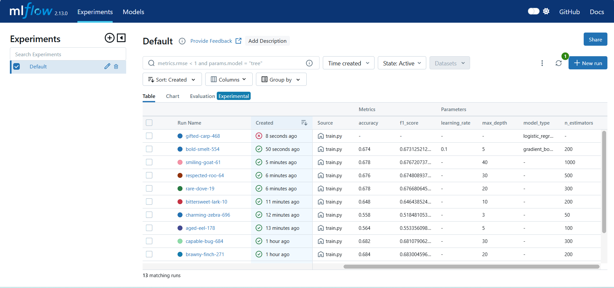
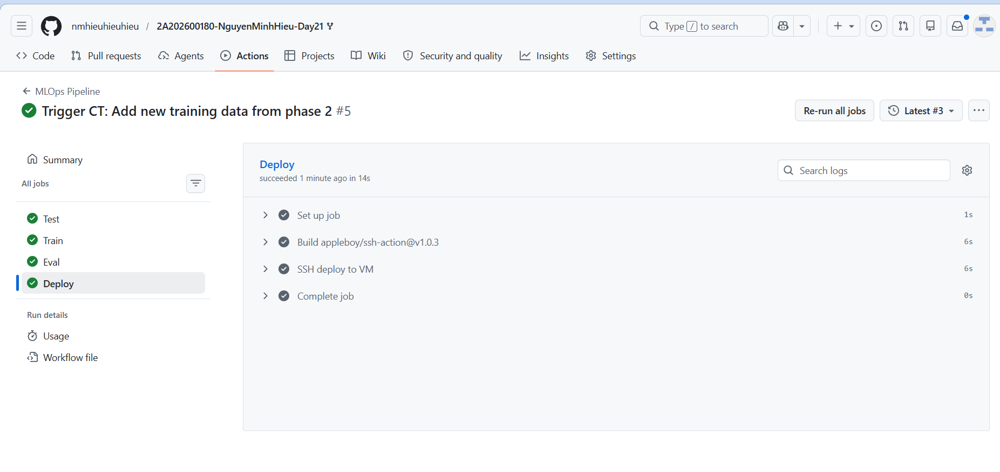
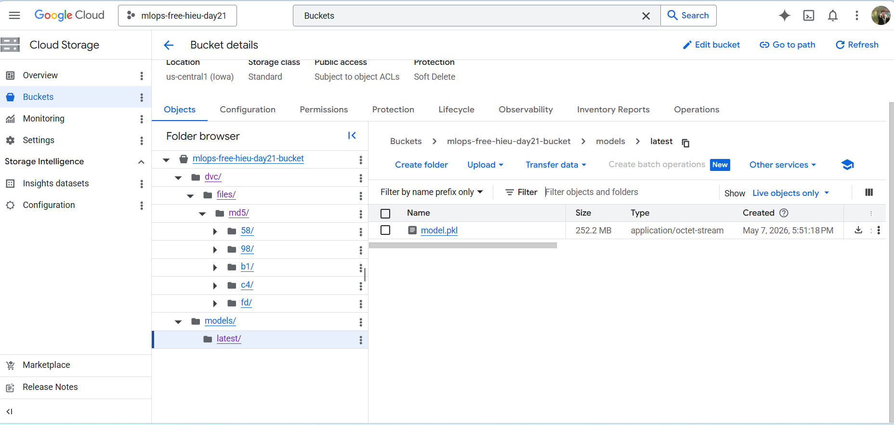
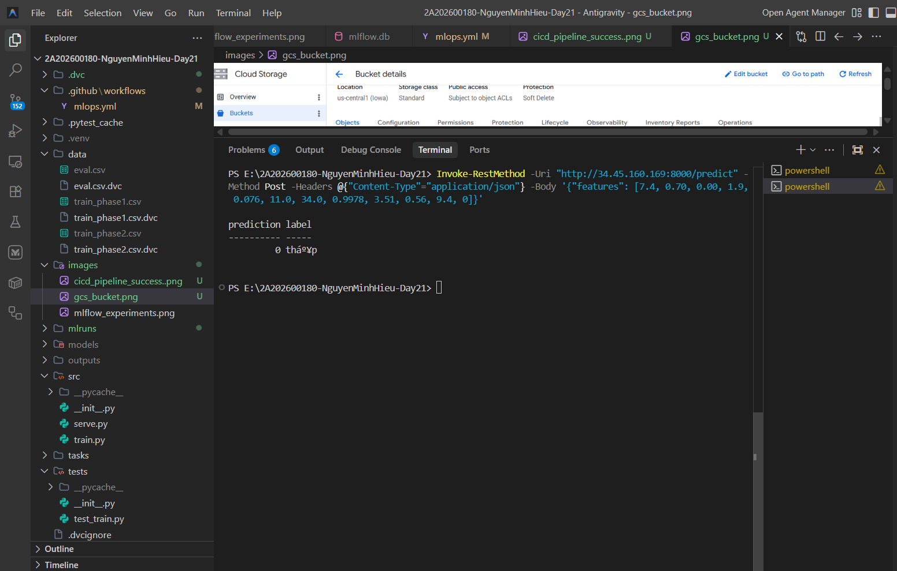

# MLOps Project Report - Day 21 Lab

**Name:** Nguyễn Minh Hiếu

**Student ID:** 2A202600180

## 1. Phase 1: Machine Learning Experimentation (MLflow)
In this phase, I trained and compared multiple algorithms on the Wine Quality dataset.

*   **Algorithms Tested:** RandomForest, GradientBoosting, LogisticRegression.
*   **Best Result:** The **RandomForest** model with `n_estimators=1000` and `max_depth=40` achieved the highest Accuracy of **0.682** and an F1-score of **0.681**.
*   **Evidence:**

## 2. Phase 2: CI/CD Pipeline & Infrastructure
I fully automated the system using GitHub Actions and integrated it with Google Cloud infrastructure.

*   **Infrastructure:**
    *   **DVC Remote:** Data and models are managed by DVC and stored on **Google Cloud Storage** (GCS).
    *   **Serving:** The model is deployed as an API (FastAPI) on a **Compute Engine (VM)** instance.
*   **CI/CD Pipeline:** Consists of 4 automated stages:
    1.  **Test:** Runs Unit Tests to ensure code logic is correct.
    2.  **Train:** Pulls data from GCS, retrains the model, and saves the artifacts.
    3.  **Eval:** Checks model quality (Accuracy >= 0.65) and compares it with the previous version before allowing deployment.
    4.  **Deploy:** Automatically updates the model on the VM via SSH and restarts the service.
*   **Evidence:**

## 3. Phase 3: Continuous Training & API Serving
After the pipeline completed, the API was ready to serve real-world predictions.

*   **API Status:** The `mlops-serve` service is running stably on port 8000 of the VM.
*   **Prediction Test:** I sent a POST request to the `/predict` endpoint with wine features and successfully received the prediction result.
*   **Evidence:**

## 4. Bonus Features Implemented
*   **Bonus 3:** Automatically exports a `report.txt` containing the Confusion Matrix and Classification Report to GitHub Artifacts.
*   **Bonus 4 (Safe Deploy):** The pipeline automatically compares the Accuracy of the new model with the old model. If the new model performs worse, the system automatically aborts the deployment to protect the service.
*   **Bonus 5 (Data Warning):** The system automatically checks the data distribution and issues a warning if there is a class imbalance (any class accounting for less than 10%).

---

